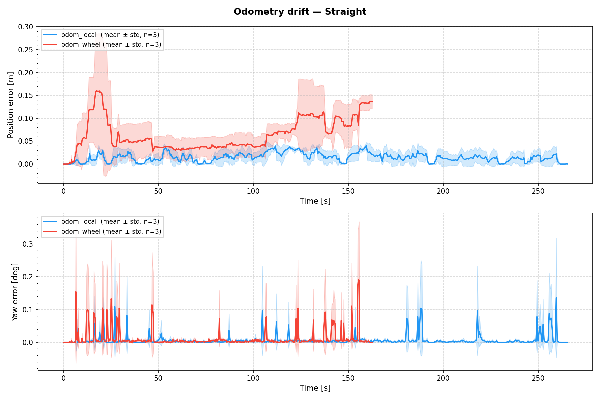
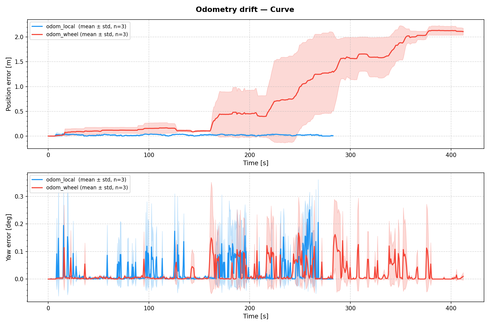
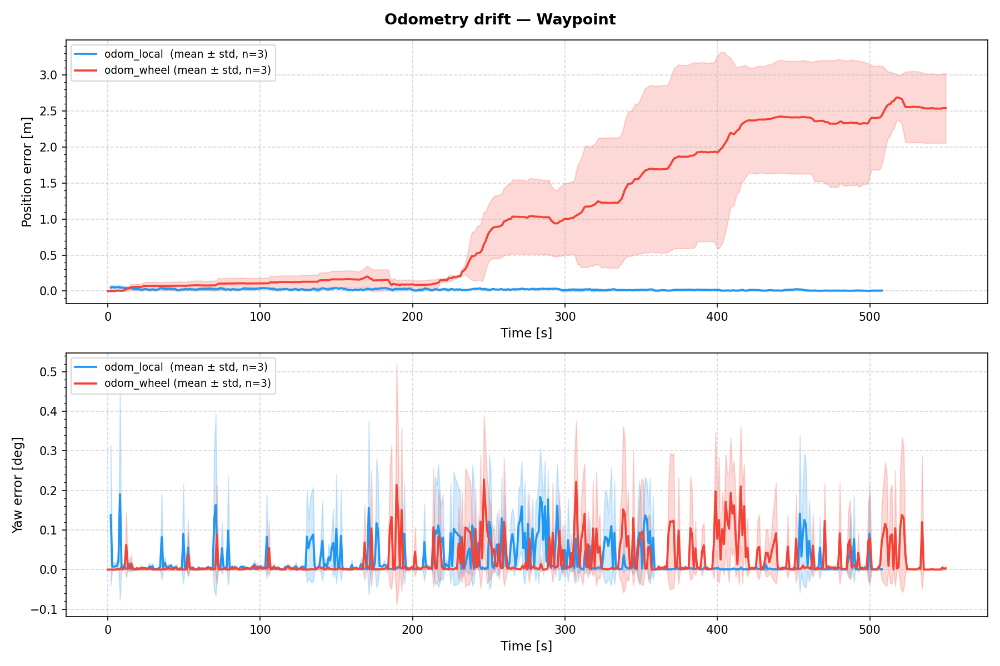
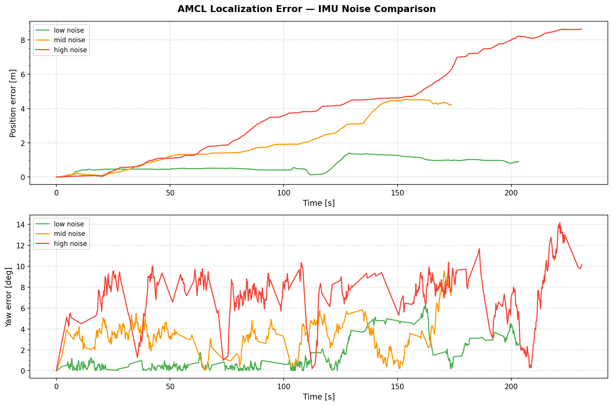
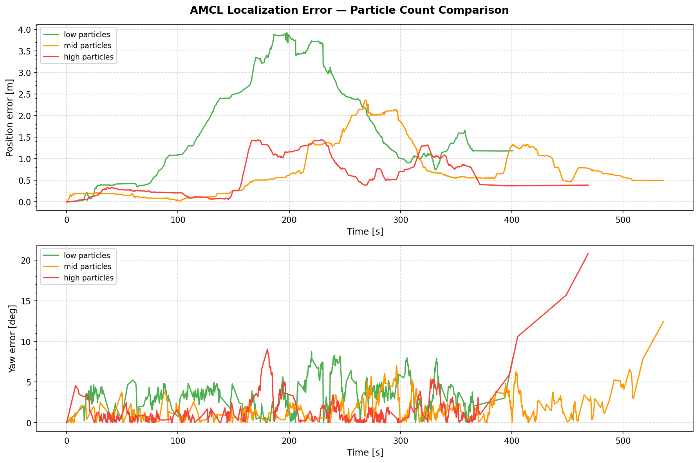

# Localization Evaluation

CARLA 시뮬레이터 기반 MK-Mini 자율주행 검증 실험 결과 정리
평가 지표: AMCL 추정 위치 vs CARLA Ground Truth

---

## 실험 목록

| # | 실험명 | 핵심 비교 |
|---|--------|-----------|
| 1 | [cmd_vel 변환 패키지 비교](#실험-1-cmd_vel-변환-패키지-비교) | Twist vs Ackermann |
| 2 | [Odometry 비교](#실험-2-odometry-비교) | GT odom vs Custom (speedometer + IMU) |
| 3 | [IMU 노이즈 영향](#실험-3-imu-노이즈-영향) | IMU noise_stddev 정도에 따른 위치 추정 성능 |
| 4 | [Particle 수 비교](#실험-4-particle-수-비교) | AMCL particle 수에 따른 위치 추정 성능 |

---

## 실험 1: cmd_vel 변환 패키지 비교

### 실험 개요
- Nav2에서 만들어낸 /cmd_vel을 차량에 전달할 때 차량 제어 명령 변환 방식 비교
- **Twist**: `/cmd_vel` (선속도 + 각속도) 직접 전달
- **Ackermann**: `/cmd_vel` → AckermannDrive (조향각 + 속도) 변환 후 전달
- 평가: 주행 중 AMCL 위치/yaw 추정 오차

### 실험 조건
- desired_linear_vel: 0.5m/s
- Custom odometry 적용
- 네 개의 고정 Waypoint를 주행하는 것을 시뮬레이션으로 구성
- 같은 시뮬레이션을 3번 주행해 평균치를 결과로 도출함.

### 결과

| **지표** | **ackermann** | **twist** |
| --- | --- | --- |
| **위치 오차 평균** | 약 0.45~0.5m | 약 0.65~0.8m |
| **Yaw 오차 최대** | 약 3.5deg | 약 4.0deg |

### 그래프

### 결론
- ackermann이 twist 대비 위치 오차가 **약 20~30%** 낮아 더 유효함을 확인
- 초반엔 Twist, 후반엔 Ackermann의 Yaw 오차가 높음 -> 전반적으로 비슷
- Ackermann의 **재현성이 더 높음(음영 비교).**

---

## 실험 2: Odometry 비교

### 실험 개요
- **GT (odom_local)**: CARLA `/carla/hero/odometry` (절대 위치) → TF 변환
- **Custom (odom_wheel)**: speedometer + IMU dead reckoning (실차 전환 가능한 구성)
- 실차 전환을 고려해 CARLA 의존적인 odometry가 아닌 자체 odometry 설계 및 성능 검증
- 이후 실차 환경에서 wheel_encoder + IMU + EKF 조합으로 개선 예정
- 평가: 주행 중 AMCL 위치/yaw 추정 오차

### 실험 조건
- desired_linear_vel: 0.5m/s
- 직선 경로(Straight), 곡선 포함 경로(Curve), 다중 goal(Waypoint)로 케이스를 나눠 시뮬레이션을 구성
- 케이스마다 세 번씩 주행해 평균치를 결과로 도출함.

### 결과

- **위치 오차 (Position Error)**

| **시나리오** | **평균 오차** | **최대 오차** |
| --- | --- | --- |
| **Straight** | 약 0.05~0.08m | 약 0.15m |
| **Curve** | 약 0.8~1.0m | 약 2.1m |
| **Waypoint** | 약 1.2~1.5m | 약 2.5m |

- **Yaw 오차 (Yaw Error)**

| **시나리오** | **평균 오차** | **최대 오차** |
| --- | --- | --- |
| **Straight** | 약 0.03~0.05deg | 약 0.15deg |
| **Curve** | 약 0.05~0.08deg | 약 0.15deg |
| **Waypoint** | 약 0.05~0.10deg | 약 0.50deg |

### 그래프

### 결론
- 적분 오차로 인해 주행 거리가 길어질수록 오차가 누적되어 Waypoint(다중 goal) 시나리오 기준 평균 약 1.2~1.5m의 위치 오차 발생
- Odometry 계산 시 누적되는 적분 오차로 인해 주행거리가 길어질수록 오차가 점차 커짐을 확인
- 완벽한 수준은 아니나 주행 테스트에서 큰 문제가 발생하지 않았고, 직선 구간 비중이 높은 주차장 환경에서는 Custom odometry도 실용적 수준 확인

---

## 실험 3: IMU 노이즈 영향

### 실험 개요
- 현재 CARLA 시뮬레이터 상에서 IMU의 noise는 없음 -> IMU가 주행에 영향을 주지 않음.
- 실차 환경에 최대한 맞추기 위해 IMU의 noise에 따라 위치 추정 오차가 얼마나 달라지는지 확인하기 위함.

### 실험 조건
- desired_linear_vel: 0.5m/s
- Custom odometry 적용
- IMU noise: 0.01 / 0.05 / 0.1 로 나누어서 테스트 진행

### 결과

- **위치 오차 (Position Error)**

| **노이즈 수준** | **평균 오차** | **최대 오차** |
| --- | --- | --- |
| **low (0.01)** | 약 0.5~0.8m | 약 1.4m |
| **mid (0.05)** | 약 2.0~2.5m | 약 4.5m |
| **high (0.1)** | 약 4.0~5.0m | 약 8.7m |

- **Yaw 오차 (Yaw Error)**

| **노이즈 수준** | **평균 오차** | **최대 오차** |
| --- | --- | --- |
| **low (0.01)** | 약 0.5~1.0deg | 약 5.0deg |
| **mid (0.05)** | 약 2.0~3.0deg | 약 6.0deg |
| **high (0.1)** | 약 5.0~7.0deg | 약 14.0deg |

### 그래프

### 결론
- 노이즈 수준이 높아질수록 평균 위치 오차 약 8배, 평균 Yaw 오차 약 7배 증가함을 확인
- 실차 환경에서는 **IMU noise가 필연적**으로 존재하므로 이를 보완할 방법이 필요

---

## 실험 4: Particle 수 비교

### 실험 개요
- AMCL: Particle 기반 확률적으로 위치 추정 -> Particle 수가 커질수록 연산량은 많아지나, 위치 추정 성능은 좋아짐.
- 실차 환경에서는 IMU noise가 필연적임.
- 이에 따라 Particle 수에 따라서 noise를 얼마나 잡아낼 수 있고, 위치 추정 성능이 얼마나 달라지는지 확인
- 위치 추정 성능과 연산량 사이의 trade-off를 확인

### 실험 조건
- desired_linear_vel: 0.5m/s
- IMU noise: 0.05
- Custom odometry 적용
- Particle 수(min/max): 500/2000, 1000/5000, 2000/10000

### 결과

- **위치 오차 (Position Error)**

| **Particle 설정** | **평균 오차** | **최대 오차** |
| --- | --- | --- |
| **low (500/2000)** | 약 0.8~1.2m | 약 3.9m |
| **mid (1000/5000)** | 약 0.4~0.6m | 약 2.2m |
| **high (2000/10000)** | 약 0.3~0.5m | 약 1.5m |

- **Yaw 오차 (Yaw Error)**

| **Particle 설정** | **평균 오차** | **최대 오차** |
| --- | --- | --- |
| **low (500/2000)** | 약 2~3deg | 약 8deg |
| **mid (1000/5000)** | 약 2~3deg | 약 7deg |
| **high (2000/10000)** | 약 2~3deg | 약 21deg |

### 그래프

### 결론
- 위치 오차는 Particle 수가 많을수록 낮아지는 경향을 보임. (low → high 기준 평균 위치 오차가 **약 2배로 감소**)
- Yaw 오차는 high particles 실험에서 주행 마지막에 Yaw 오차가 급격히 치솟는 현상이 발생 -> Particle 수가 너무 많아지면서 **연산량이 증가**해 **처리 지연이 발생한 영향**으로 판단
- Particle 수가 많을수록 **위치 추정 정확도는 높아지나** **연산량이 증가**해 **주행 시간이 길어짐.**